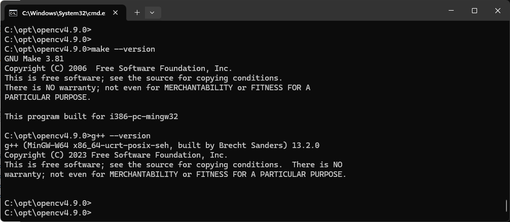

# opencv-mingw
OpenCV demo built with MinGW in Windows

    git clone --branch 4.9.0 https://github.com/opencv/opencv.git opencv4.9.0-repo
    cd opencv4.9.0-repo
    loadenv
    cmake-gui .

    make -j8
    make install
    copy opencv4.9.0\install\x64\mingw\bin\libopencv_videoio490.dll .
    copy opencv4.9.0\install\x64\mingw\bin\libopencv_core490.dll .
    copy opencv4.9.0\install\x64\mingw\bin\libopencv_imgcodecs490.dll .
    copy opencv4.9.0\install\x64\mingw\bin\libopencv_imgproc490.dll .
